

  

    <a href="index.html">Home</a>
    /
    Final Report
  

  <h1>Final Report</h1>
  
A comprehensive overview of our approach, models, results, and insights from training agents to play 2048.

  <!-- Video -->
  

    

      
00

      <h2 class="section-title">Video Submission</h2>
    

    

      
A final walkthrough video covering our complete approach, all three models, results, and takeaways.

      

        <iframe
          src="https://www.youtube.com/embed/YkONd-Powgs"
          title="PowerOf2 — Final Video Submission"
          frameborder="0"
          allow="accelerometer; autoplay; clipboard-write; encrypted-media; gyroscope; picture-in-picture; web-share"
          allowfullscreen>
        </iframe>
      

    

  

  <!-- Introduction -->
  

    

      
01

      <h2 class="section-title">Introduction</h2>
    

    

      
What is 2048?

      

        

          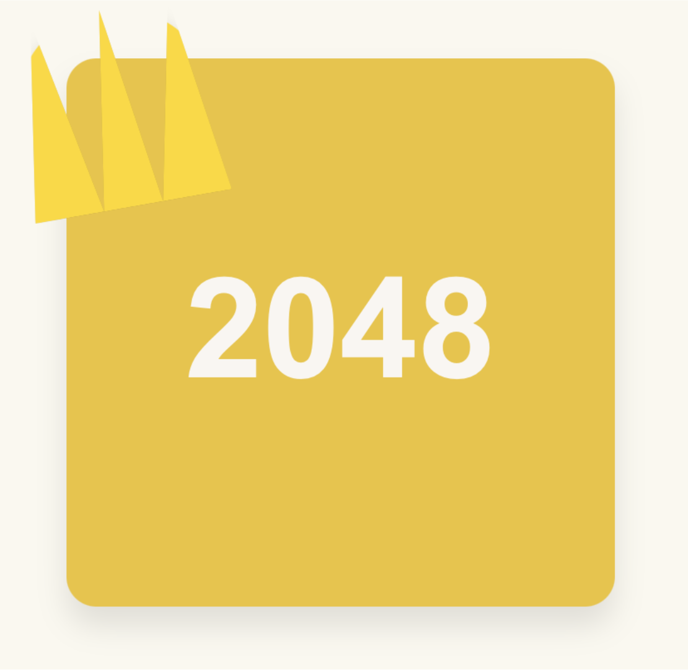
        

        

          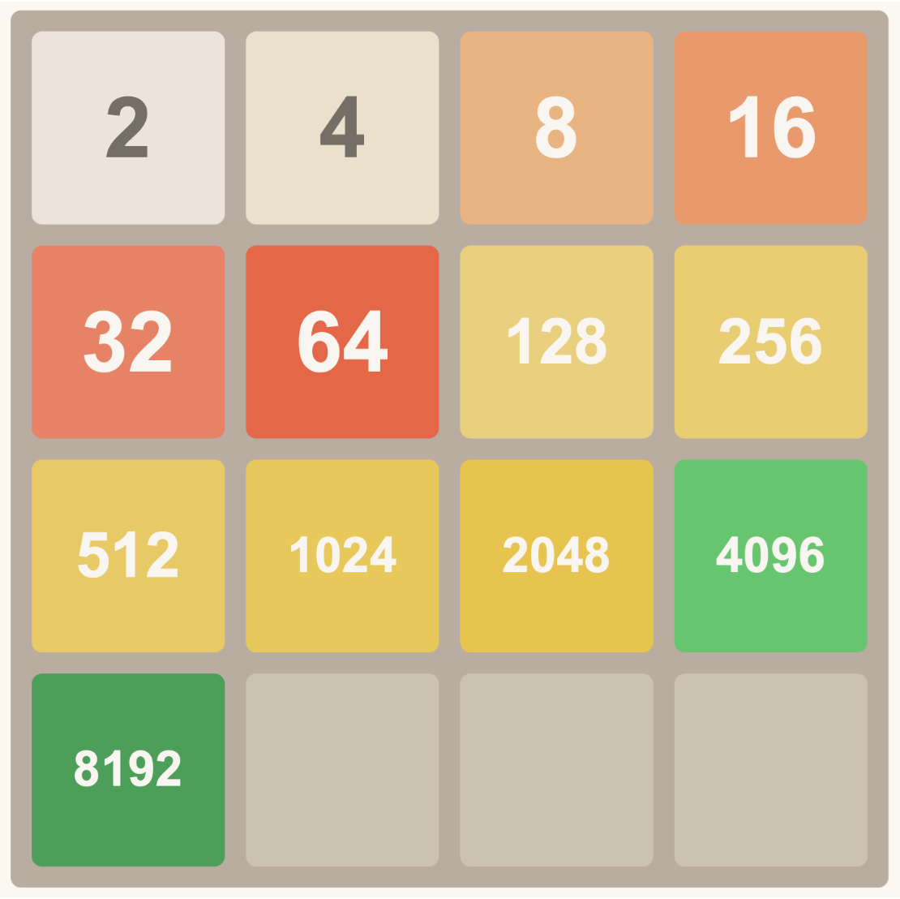
        

      

      

        2048 is a solo player web game where the objective is to merge like tiles to eventually — hopefully — produce the 2048 tile. Each tile is a power of 2, and the player begins with twos and fours scattered across the board.
      

      

        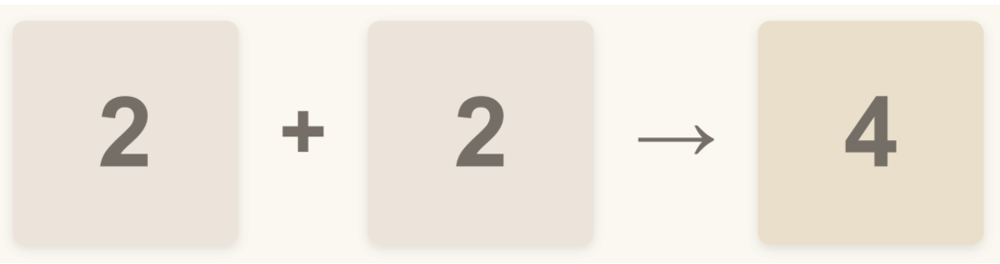
      

      
How to Play

      

        There are 4 possible moves a player can make on any given turn: <strong>up, down, left, right</strong>. After each move, the game adds a random tile (2 or 4) into a random empty cell. Each move slides all existing tiles in the chosen direction. Only when two like tiles — tiles of the same power of two — collide can they merge into one new tile of the next power of two; the two merged tiles disappear and are replaced by their combined value.
      

    

  

  <!-- Progress States -->
  

    

      
02

      <h2 class="section-title">Progress States</h2>
    

    

      

        

          
Past

          
In the beginning of our project, we were only able to just barely get 1024 as the maximum tile. Most of our models were reaching 512.

        

        

          
Present

          
Presently, we have reached our goal of 2048 using two models — MCTS and PPO (CNN + MLP). All three of our models now consistently reach 1024.

        

        

          
Future

          
Our goal going forward is to reach 4096 (one power above 2048) and to have all three models, including DQN, reach 2048. We can also explore imitation learning or longer training runs on existing models.

        

      

    

  

  <!-- Motivation -->
  

    

      
03

      <h2 class="section-title">Motivation</h2>
    

    

      

        Our motivation for selecting this topic was that everyone on our team already knows how to play 2048. We believed the game had a straightforward success state, and that the action space could be simplified since there are only four possible moves. Lastly, we felt our own gameplay experience and general knowledge of the game allowed us to design better heuristics for reward shaping.
      

      

        In hindsight, we made some blunders in reward shaping early on — but after additional trials and iteration those were resolved successfully.
      

    

  

  <!-- Problem Statement -->
  

    

      
04

      <h2 class="section-title">Problem Statement</h2>
    

    

      

        The core challenge we found interesting is that 2048 is an <strong>inherently random game</strong>, making it difficult to learn — especially without heuristics to guide model decision making.
      

      

        2048 rewards delayed actions combined with a non-linear state space due to the collapsing of tiles column- and row-wise. Rewarding small movements instead of long-term gains causes tiles to be combined without any strict strategy, leading to small noisy movements that produce game-overs. Tile generation is also random — new tiles can appear anywhere on the board as either 2 or 4 — which means RL algorithms cannot rely on strictly deterministic patterns and must develop probabilistic strategies instead.
      

      

        The real goal is making long-term decisions that increase the mergeability of tiles, extending the reward horizon rather than chasing greedy local score increases. Humans make this same mistake when playing naively. We want models that can exploit strategies leading to good games despite an environment of randomness, non-linear state transitions, and long reward horizons.
      

    

  

  <!-- DQN Approach -->
  

    

      
05

      <h2 class="section-title">Approach — DQN</h2>
    

    

      

        One of the models we trained is a <strong>Deep Q-Network (DQN)</strong> using a Multilayer Perceptron policy. DQN takes in a 4×4 2D array representing the board state, where <strong>0 represents empty cells</strong> and positive integers represent the power of 2 occupying that cell — for example, a cell with value 3 represents 2³ = 8. This encoded array is passed to a hidden MLP network that learns patterns correlated with high rewards, then outputs a discrete action (0–3, corresponding to up, down, left, right) based on the estimated Q-value for each action.
      

      

        After making the selected move, the transition is stored in a <strong>replay buffer</strong>. During training, DQN samples randomly from this buffer and checks the resulting board state, receiving rewards for transitions that lead to a higher total score. This decouples the temporal order of experience from learning, reducing correlation between consecutive updates.
      

      
Loss Function

      
L(θ) = E[(y − Q(s, a; θ))²]

where  y = r + γ · max_a' Q(s', a'; θ⁻)

      

        The target Q-value <strong>y</strong> is computed using a separate frozen target network (θ⁻), updated periodically. This stabilizes training by preventing the moving target problem inherent in naive Q-learning, where the network would otherwise chase a constantly shifting objective. Gradients are backpropagated through the loss to update the online network θ. This separate target network is why the loss function can appear unstable during training.
      

      

        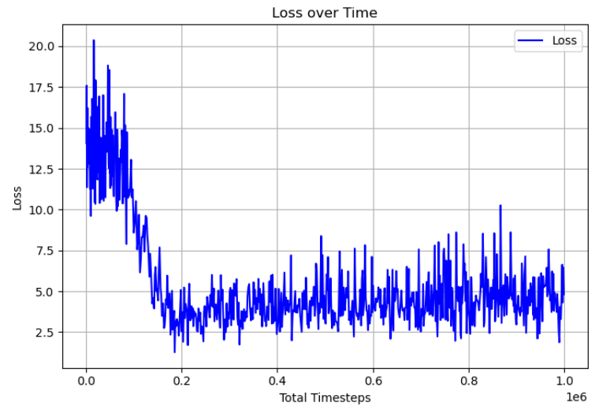
      

      
DQN Loss Curve

      

        With the default DQN environment provided by stable_baselines3, the model does not learn to avoid illegal moves — moves where the board state does not change — and ultimately gets stuck repeating them indefinitely. Penalizing illegal moves was attempted, but the model still lacked persistent memory of <em>why</em> a specific move was illegal for a given board state. In the end, we wrapped the environment to train with an illegal move punishment and a corner reward, implementing the corner strategy.
      

      
Final Hyperparameters

      

        
learning_rate1e-4

        
buffer_size100,000

        
learning_starts1,000

        
batch_size512

        
exploration_fraction0.3

        
total_timesteps10,000

      

      

        Hyperparameters were not fully fine-tuned due to time constraints. On the hpc3 server without sbatch, training took much longer — sometimes hours — for performance ending in a maximum tile of 64. On the openlab server, training was substantially faster. With larger timesteps, buffer sizes, and batch sizes, training could result in maximum tiles of 100+, though it never reached 1000+. The final DQN implementation shows signs of successfully training with the corner strategy, but reward plateaus prevent it from reaching higher tiles.
      

      

        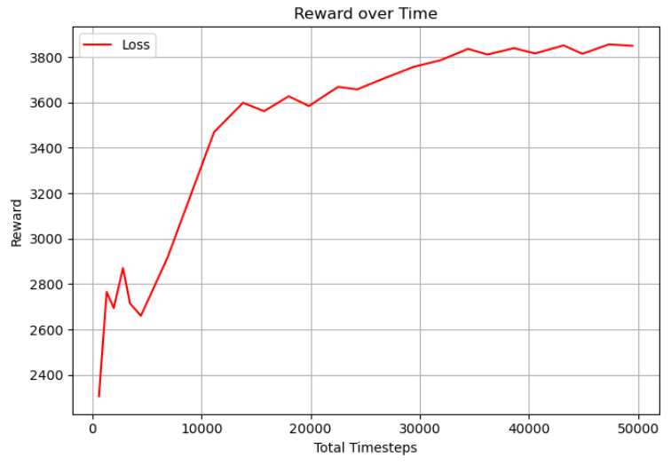
      

      
DQN Reward Curve

      

        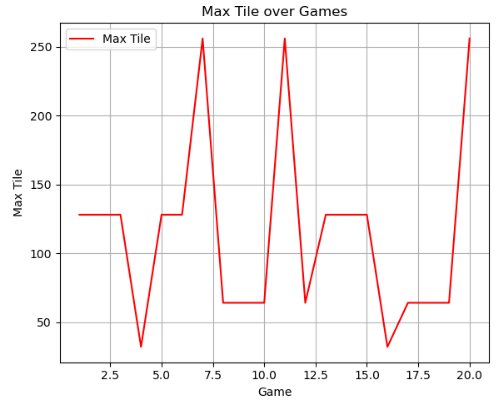
      

      
DQN Max Tile Over Training

      

        In the future, we would want to increase or eliminate this reward plateau so the model can learn to reach higher maximum tiles. This could involve implementing more strategies, adjusting the exploration fraction to better account for 2048's inherent randomness, or using a stronger network architecture with additional layers and larger batch sizes.
      

    

  

  <!-- MCTS Approach -->
  

    

      
06

      <h2 class="section-title">Approach — MCTS</h2>
    

    

      

        Another algorithm we implemented is a heuristic-guided <strong>Monte Carlo Tree Search (MCTS)</strong> that performs <em>n</em> rollouts per move. Unlike PPO and DQN, MCTS does not learn a policy or a value function — it relies entirely on the tree built during search, aggregating rollout results to select moves at each decision point.
      

      

        At each decision point, MCTS expands nodes for different board states and performs rollouts. While traditional MCTS follows fully random rollouts, this naive approach does not account for two key issues: 2048's inherent randomness and its rapidly changing state space. Results from each rollout are backpropagated up through the tree to update node values, allowing the algorithm to estimate which action will yield the best outcome based on the <strong>Upper Confidence Bounds (UCB)</strong> formula:
      

      

        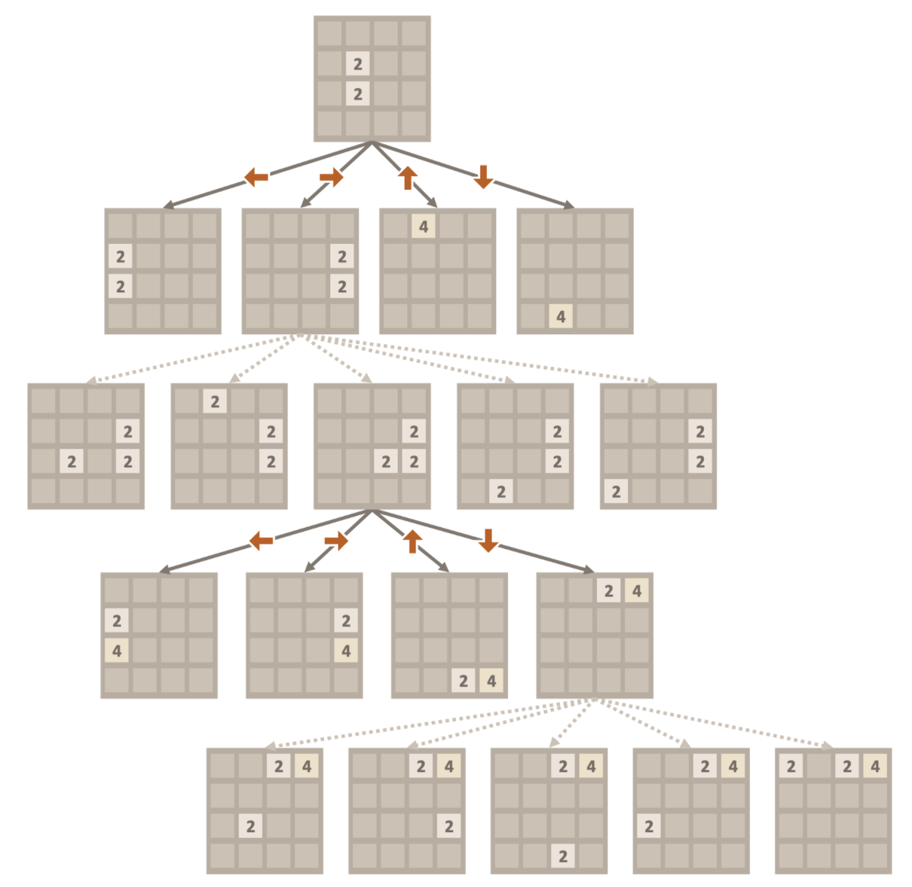
      

      
Graphic via poomstas/2048_MCTS @ github

      
UCB = exploitation_term + c · sqrt(ln(N) / n)

where  N = total visits to parent node
       n = visits to this child node
       c = exploration constant

      

        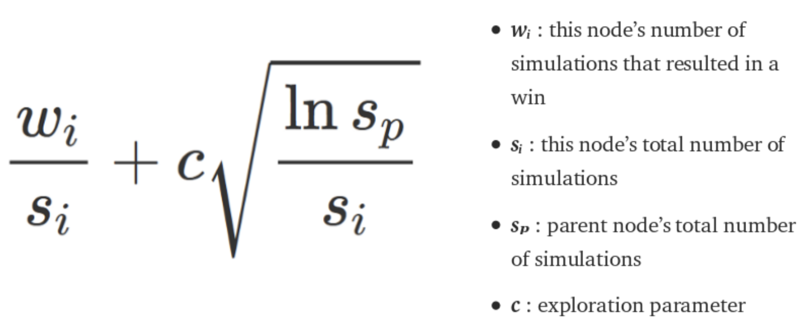
      

      
Graphic via StackOverflow

      
Heuristics

      

        Random rollouts introduce significant noise — especially in a stochastic state space. We added heuristics to guide rollout selection so they follow strategies grounded in real 2048 gameplay:
      

      

        

          01
          

            
Empty Tile Weighting

            
Boards with more empty cells are rewarded. Any move can spawn an unmergeable tile anywhere on the board, so maintaining flexibility by keeping cells open increases future merge opportunities.

          

        

        

          02
          

            
Monotonicity Score

            
Tiles are rewarded for following a snake-like ordering — consistently increasing or decreasing across rows and columns — enabling strategic chaining of merges in a single sweep.

          

        

        

          03
          

            
Corner Bias

            
High-value tiles positioned in a corner receive a bonus. Corner anchoring enables cascading collapses by keeping the highest tile stationary while merging descending tiles around it.

          

        

        

          04
          

            
Smoothness

            
Adjacent tiles with similar values are rewarded because they can be merged given the right opportunity. Smooth boards reduce the number of moves needed to collapse adjacent tiles.

          

        

        

          05
          

            
Exploration Constant c

            
Controls the balance between exploitation of high-value nodes and exploration of less-visited ones in the UCB formula. Tuned experimentally against the other heuristic weights.

          

        

      

      
Experimental Findings

      

        Based on these heuristics, we could then do experimental analysis to find the best combination of parameters:
      

      

        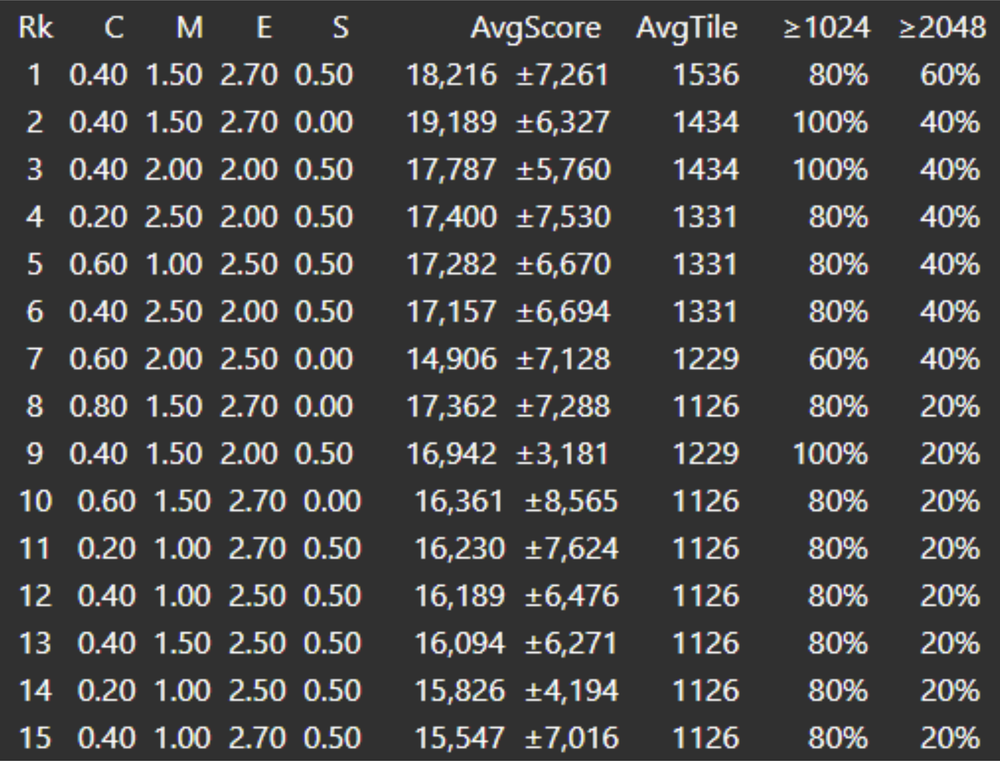
      

      
Rollout Parameters

      
Three rollout parameters were tuned to balance performance against computational cost:

      

        
Time per MoveBudget (s)

        
Num. Simulationsn rollouts

        
Rollout Depthmax steps

        
Heuristic weightstuned grid

      

      
Results

      
This ultimately results in the best combination of parameters which came out to be:

      

        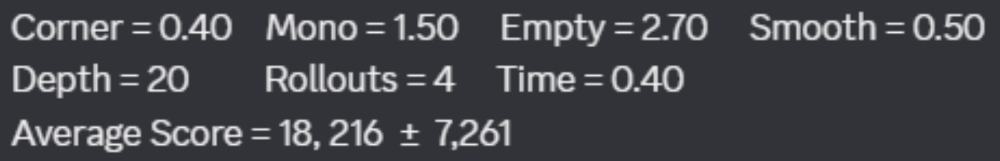
      

      

        More rollouts and deeper rollout depth generally produce higher scores by giving the tree more information — but this directly increases time per game. Games that ran faster (less compute) scored lower because they reached game-over sooner, while slower games running around 8 minutes were able to reach the 2048 tile.
      

      
When ran on our baseline of 20 games, we saw:

      

        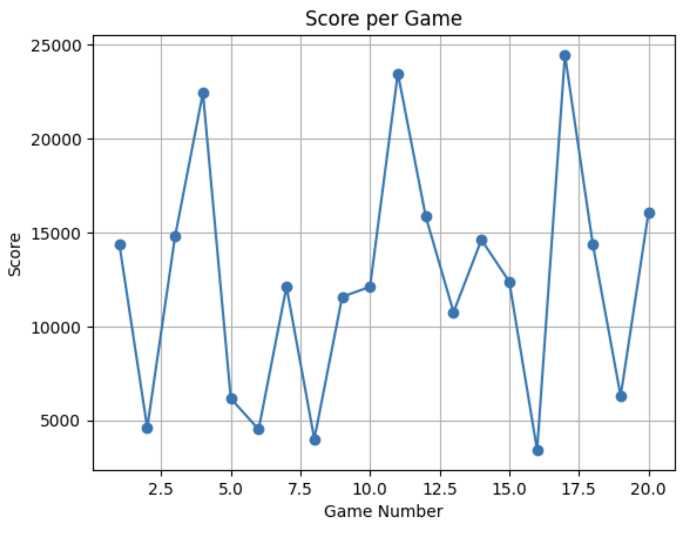
      

      

        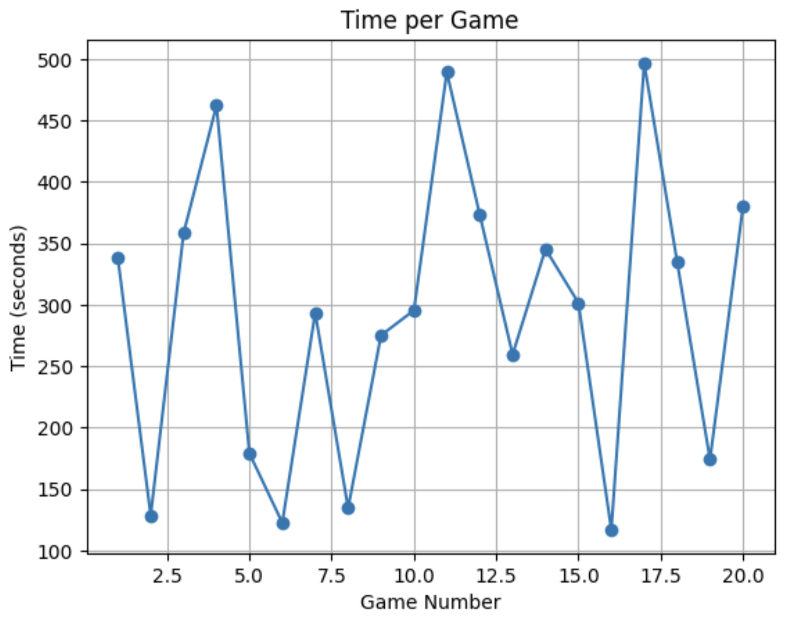
      

      

        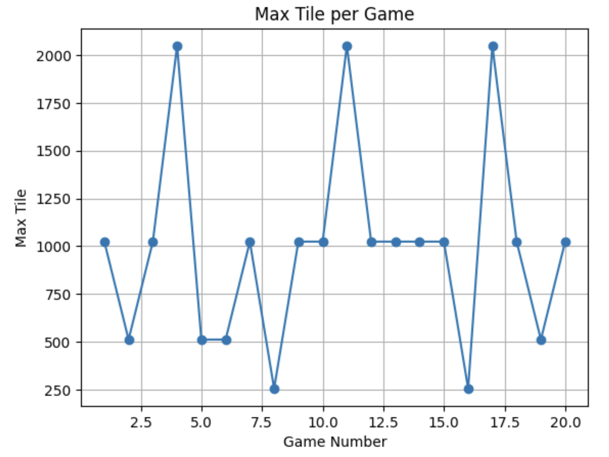
      

      

        

          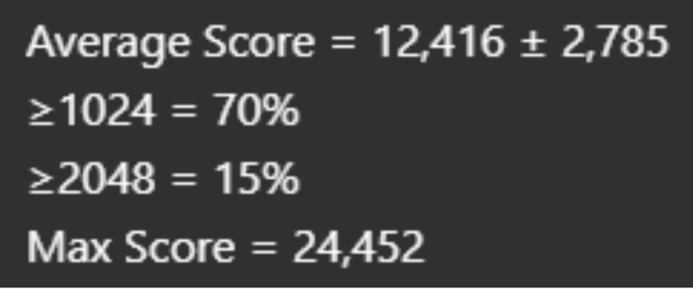
        

      

      
Key Insight

      

        

          Insight
          Performance Scales with Compute
        

        

          MCTS performance is directly tied to hardware speed. Machines with faster CPUs can run more simulations within the same time budget, producing stronger play. This means identical configurations yield different results across machines — beyond 2048's inherent randomness — and time-based limits are hardware-dependent. MCTS does not retain knowledge between games, making it much more expensive and less scalable than trained models. While it can perform comparably to a tuned RL model given sufficient compute, the runtime cost is substantially higher.
        

      

    

  

  <!-- PPO Approach -->
  

    

      
07

      <h2 class="section-title">Approach — PPO (CNN + MLP)</h2>
    

    

      

        The PPO model uses a fully custom training loop with a <strong>CNN + MLP dual-path architecture</strong>. Unlike DQN's off-policy Q-value approach, PPO is an on-policy actor-critic method that directly optimizes a clipped surrogate objective, preventing destructively large policy updates while still making meaningful gradient steps each iteration.
      

      

        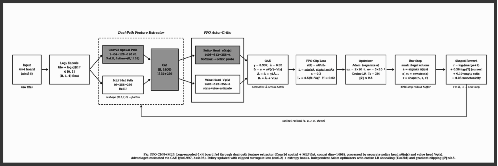
      

      
Input Encoding

      

        The board is first <strong>log₂-encoded</strong>: each tile value t is mapped to log₂(t) / 17, compressing the range 2–131072 into a uniform [0, 1] scale. Raw tile values span five orders of magnitude, making them poor direct inputs. Log₂ encoding gives both the convolutional and flat MLP paths equally scaled features to work with.
      

      
Network Architecture

      

        The encoded board is processed by two parallel paths:
      

      

        
Spatial path (Conv2d)1→64→128→128 channels

        
Flat path (MLP)16→256→256

        
Combined head1408→512→256→4

        
Value head output1408→512→256→1

      

      

        The convolutional path sees the board spatially as a (1, 4, 4) image, learning positional tile relationships: corner anchoring, adjacency for merging, diagonal arrangements. The flat MLP path treats the board as a vector of 16 numbers — every cell talks to every other equally, regardless of position — providing global context over tile distribution. Their outputs are concatenated and passed to separate policy and value heads.
      

      
Actor-Critic (PPO)

      

        PPO is an actor-critic framework. The <strong>actor</strong> is the policy π(a|s) that looks at the current board state and decides which of the four actions to take. The <strong>critic</strong> is the value function V(s) — it looks at the board and produces a score quantifying how good the current state actually is. The critic never takes actions; it only judges the actor.
      

      

        A critical problem in policy gradient methods is that overly aggressive updates can erase all previously learned strategies. PPO counters this using the ratio between the new and old policy:
      

      
r(θ) = π_θ(a|s) / π_θ_old(a|s)   =   exp(log π_θ(a|s) − log π_θ_old(a|s))

L_CLIP = E[ min(r(θ) · Â,  clip(r(θ), 1−ε, 1+ε) · Â) ]   where ε = 0.2

L_policy = −L_CLIP − 0.02 · H[π_θ]

      

        The entropy bonus <strong>H[π_θ]</strong> (coefficient 0.02) discourages premature convergence to a deterministic policy, keeping the agent exploring alternative move sequences throughout training. The value loss is computed separately:
      

      
L_value = 0.5 · E[ (Rᵢ − V_φ(sᵢ))² ]

      
Generalized Advantage Estimation (GAE)

      

        Rather than using raw returns or single-step TD errors, advantages are computed via GAE with γ = 0.997 and λ = 0.95. Starting from the last step in the rollout buffer and working backwards:
      

      
δᵢ    = rᵢ + γ · V(sᵢ₊₁) · (1 − doneᵢ) − V(sᵢ)
Âᵢ    = δᵢ + γλ · (1 − doneᵢ) · Âᵢ₊₁
Rᵢ    = Âᵢ + V(sᵢ)         [returns for value loss]

      

        δᵢ is the one-step TD error. GAE exponentially discounts future TD errors, controlled by λ: λ = 0 reduces to pure TD (low variance, high bias), λ = 1 reduces to full Monte Carlo (high variance, low bias). λ = 0.95 sits close to the Monte Carlo end, capturing long multi-step merge sequences without excessive variance. Advantages are then normalized across the batch: Â ← (Â − mean(Â)) / (std(Â) + ε).
      

      
Adam Optimizers

      

        The actor and critic use independent Adam optimizers with separate learning rates. Adam provides two key improvements over basic gradient descent:
      

      
m = β₁·m + (1-β₁)·g          # running mean of gradient
v = β₂·v + (1-β₂)·g²         # running mean of squared gradient
w = w - α · m / (√v + ε)      # weight update

      

        <strong>Momentum:</strong> instead of using only the current gradient, Adam maintains a running average of past gradients, smoothing noisy updates. If the model has historically pointed in a given direction, it takes a larger step that way. <strong>Adaptive learning rates:</strong> each parameter receives its own effective learning rate — parameters with consistently large gradients are scaled down, small gradients are scaled up. The m/√v term is what makes learning adaptive.
      

      

        Using separate optimizers means the critic (value_lr = 5e-4) and actor (policy_lr = 1e-4) can move at different speeds. In practice, the critic converges earlier, supplying better advantage signals to the actor sooner — our model reached 2048 at around 50k episodes.
      

      
Reward Function

      
The shaped reward for each step combines four components:

      
r = log₂(merge_score + 1)
  + 0.30 · log₂(max_tile + 1)   [if max_tile is in a corner]
  + 0.10 · empty_cells
  − 0.05 · monotonicity_penalty

      

        The base term <strong>log₂(merge_score + 1)</strong> is scale-invariant — merging two 512 tiles (score 1024) yields log₂(1025) ≈ 10, while merging two 2 tiles (score 4) yields log₂(5) ≈ 2.3, a proportional difference rather than a 256× raw difference. The monotonicity penalty accumulates log₂ differences across adjacent tile pairs that violate ascending order in any row or column:
      

      
mono = Σ_{rows} Σ_{j} max(0, log₂(row[j]) − log₂(row[j+1]))
     + Σ_{cols} Σ_{i} max(0, log₂(col[i]) − log₂(col[i+1]))

      
Hyperparameters

      

        
γ (discount)0.997

        
λ (GAE)0.95

        
ε (clip)0.2

        
policy_lr1e-4

        
value_lr5e-4

        
ppo_epochs8

        
mini_batch512

        
rollout_steps4096

        
entropy_coef0.02

        
value_coef0.5

        
max_grad_norm0.5

        
LR scheduleCosine (T₀=2M)

      

      
Key Design Choices

      

        

          01
          

            
Log₂-Encoded Board → CNN + MLP Dual-Path Network

            
Raw tile values span five orders of magnitude (2–131072), making them poor direct inputs. Log₂ encoding compresses this to a uniform 1–17 range, giving both paths equally scaled features to work with.

          

        

        

          02
          

            
Reward = log₂(merge_score + 1)

            
Using raw merge scores creates extremely high-variance signal — merging a 1024 tile gives 500× more reward than merging a 2 tile. Log₂ transformation keeps the signal bounded and consistent across all tile magnitudes.

          

        

        

          03
          

            
Corner Placement Bonus

            
The agent receives +0.30 · log₂(max_tile + 1) when the maximum tile occupies any corner. Corner anchoring enables cascading collapses — a sequence of moves that merges multiple descending tiles in one sweep without displacing the highest tile.

          

        

        

          04
          

            
Monotonicity Penalty

            
Penalizes moves that produce non-monotonic tile arrangements by accumulating log₂ differences across all adjacent pairs that violate ascending order. Monotonic rows and columns make multi-tile chain merges possible in a single move.

          

        

        

          05
          

            
Empty Cell Bonus (+0.10 per cell)

            
A bonus per empty cell discourages filling the board prematurely. As empty cells decrease, legal moves decrease, accelerating game-over. This term keeps the agent seeking merge opportunities rather than spreading tiles.

          

        

        

          06
          

            
GAE (γ=0.997, λ=0.95)

            
High γ (0.997) values future rewards heavily — critical for 2048 where the payoff of a strategic merge may not materialize for dozens of moves. λ=0.95 keeps advantage estimates close to Monte Carlo, capturing long multi-step merge sequences without excessive variance.

          

        

        

          07
          

            
Large Rollout Buffer (4096 steps)

            
4096 steps spans multiple complete games, ensuring each policy update sees diverse board configurations — both early-game open boards and late-game crowded states. This prevents gradient updates from overfitting to any single game trajectory.

          

        

        

          08
          

            
Mini-Batch PPO (8 epochs, batch 512)

            
The 4096-step buffer is shuffled and split into 512-sample mini-batches, updated for 8 epochs per rollout. The ε=0.2 clip limits the probability ratio r(θ) to [0.8, 1.2], preventing any single update from overshooting into a bad policy region.

          

        

        

          09
          

            
Separate Adam Optimizers + Cosine LR

            
Policy (lr=1e-4) and value (lr=5e-4) networks use independent Adam optimizers. Cosine annealing with warm restarts (T₀=2M steps) progressively reduces both rates while periodically resetting to escape local minima.

          

        

        

          10
          

            
Gradient Clipping (max_norm=0.5)

            
Applied after each backward pass via torch.nn.utils.clip_grad_norm_. Without clipping, rare high-reward merges produce gradient spikes that can catastrophically overwrite previously learned strategies in a single step.

          

        

        

          11
          

            
Two Saved Checkpoints

            
The <em>latest</em> checkpoint saves every 500 episodes and on every new best tile. The <em>best-average</em> checkpoint saves only when the 100-episode rolling mean improves by more than 1%, preventing frequent overwrites from lucky individual games.

          

        

      

      
Issues &amp; Fixes During Training

      

        

          

            Issue
            Illegal Moves — Board Never Changes
          

          
In the beginning, the model never made any valid moves. With the GUI it was immediately obvious because the board would never change even as the move counter incremented.

          

            Fix
            
The environment was modified to strictly filter actions — only moves that result in a board state change are permitted. The action selection layer masks illegal moves before sampling.

          

        

        

          

            Issue
            Cyclic Move Pattern — LEFT → DOWN → RIGHT → UP Loop
          

          
Using imitation training in early iterations, the model converged on a deterministic ring pattern: LEFT, DOWN, RIGHT, UP, repeating until the board was full.

          

            Fix
            
The learning rate was increased to give the optimizer enough momentum to escape this local minimum, and the CNN + MLP dual-path architecture replaced the flat MLP, enabling spatial awareness that disrupted the cyclic attractor.

          

        

        

          

            Issue
            Diagonal Tiles — Mergeable Tiles Unable to Merge
          

          
Mergeable tiles were unable to merge because their positions were diagonally opposite. With only a flat MLP there was no spatial awareness to recognize and resolve diagonal separation.

          

            Fix
            
Adding the empty tiles heuristic combined with introducing the MLP path alongside the CNN resolved this. Training had to restart from scratch.

          

        

        

          

            Issue
            Failed Reward — Overly Lucrative High-Tile Bonus
          

          
One reward for high tiles in general was made too lucrative. The actor went on a merging spree and produced many "holes" — isolated low-power tiles trapped among high tiles — breaking monotonicity and fragmenting the board.

          

            Fix
            
The reward coefficient was reduced and replaced with the more targeted corner placement bonus, which rewards high tiles only when they occupy a corner rather than anywhere on the board.

          

        

      

      
Results

      

        

          10%
          2048 Rate (20 games)
        

        

          1024
          Avg Max Tile
        

        

          512
          Min Max Tile
        

        

          ~1.5s
          Avg Time / Game
        

      

      

        10% of results from a 20-game test end with a max tile of 2048. The average max tile across all 20 games is 1024, and the lowest max tile recorded is 512. Average time per game is approximately 1.5 seconds — at maximum, 3 seconds. This model was trained to approximately 23 million steps. Total testing time for all 20 games is under 30 seconds.
      

      

        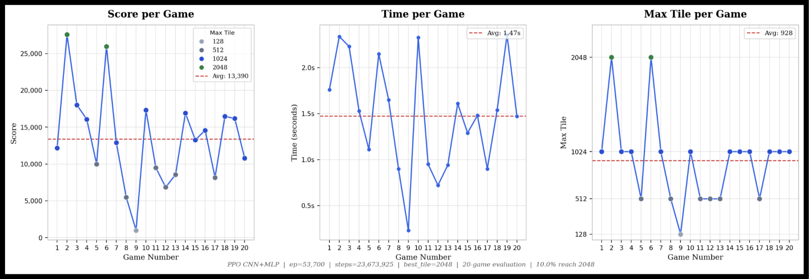
      

      

        

          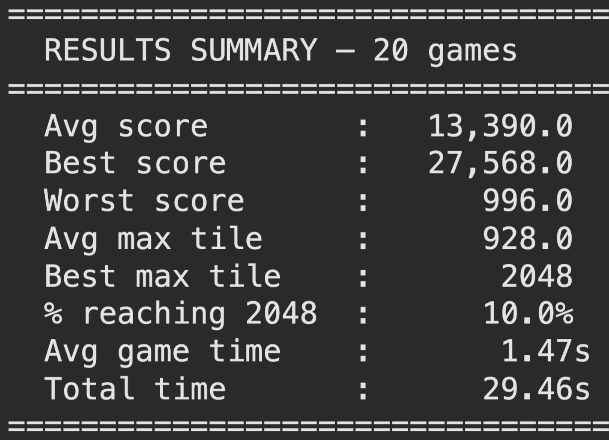
        

      

    

  

  <!-- Evaluation -->
  

    

      
08

      <h2 class="section-title">Evaluation &amp; Discussion</h2>
    

    

      

        The two primary evaluation metrics are <strong>total score</strong> (sum of all merge values across the game, matching standard 2048 scoring) and <strong>maximum tile reached</strong>. These objectively capture both the quantity of merges and their quality.
      

      
Model Comparison

      <table class="compare-table">
        <thead>
          <tr>
            <th>Model</th>
            <th>2048 Rate</th>
            <th>Avg Max Tile</th>
            <th>Avg Time / Game</th>
            <th>Learns Between Games</th>
          </tr>
        </thead>
        <tbody>
          <tr>
            <td>PPO (CNN + MLP)</td>
            <td>10% (20-game test)</td>
            <td>1024</td>
            <td>~1.5s</td>
            <td>Yes — trained weights</td>
          </tr>
          <tr>
            <td>MCTS (heuristic)</td>
            <td>Reaches 2048 w/ sufficient compute</td>
            <td>Variable by hardware</td>
            <td>Minutes per game</td>
            <td>No — search from scratch</td>
          </tr>
          <tr>
            <td>DQN (MLP)</td>
            <td>Not yet</td>
            <td>~64–100+</td>
            <td>Fast</td>
            <td>Yes — trained weights</td>
          </tr>
        </tbody>
      </table>

      
Insights

      

        

          

            Insight
            Score and Max Tile are Directly Correlated
          

          

            There is a clear direct correlation between max tile reached and total score across all three models. The main outlier is the time required per game — MCTS is the primary concern when comparing time vs. score, while PPO and DQN can be rapidly evaluated. This is inherent to MCTS's architecture of performing n rollouts per move.
          

        

        

          

            Insight
            PPO is the Best Overall Model
          

          

            There is a clear tradeoff between time and score when comparing MCTS to PPO. While MCTS achieves higher 2048 rates with sufficient compute, PPO is more stable — its 1024 and 512 rates are higher than MCTS's across equivalent test runs. PPO's robust design choices and carefully tuned heuristics make it the strongest model overall: it reaches 2048 at a reasonable training cost (50k episodes) and evaluates in approximately 1.5 seconds per game.
          

        

        

          

            Insight
            DQN Has Room to Grow
          

          

            With further research into DQN parameterization and longer training times, we believe there is more to be achieved. DQN's reward plateau currently prevents it from reaching higher tiles, but with more compute and stronger architecture choices (additional layers, larger batch sizes, more timesteps), it could close the gap. More broadly, we can explore imitation learning with additional data, or train existing models on modified 2048 variants — such as including 8 as a randomly spawning tile, using a larger board, or adding move timers — to encourage adaptability.
          

        

      

      

        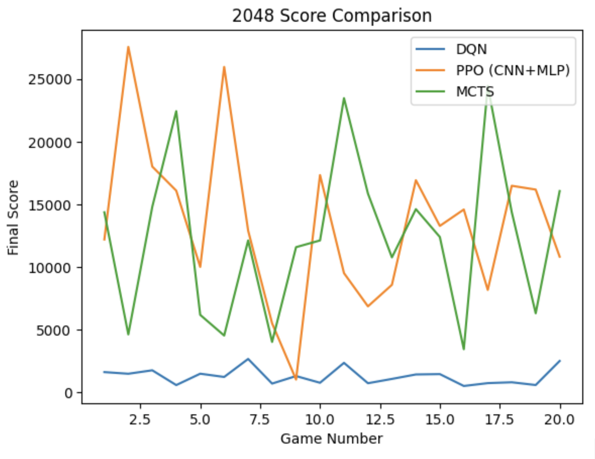
      

      

        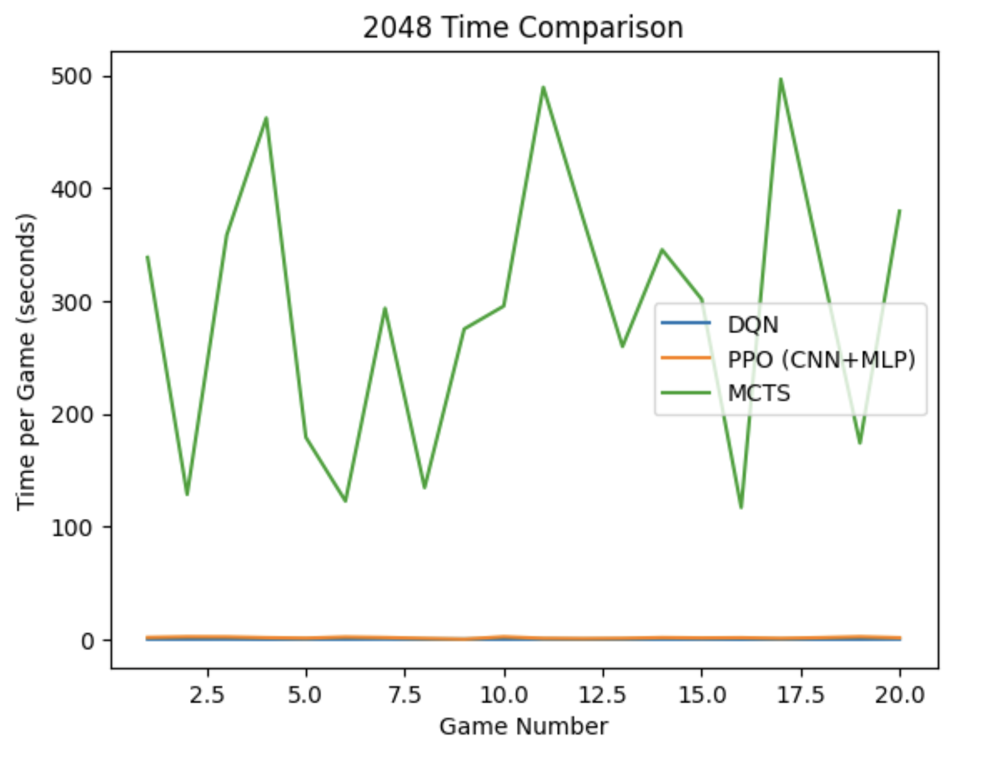
      

      

        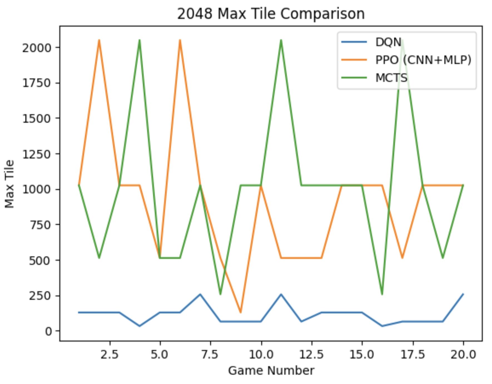
      

      

        

          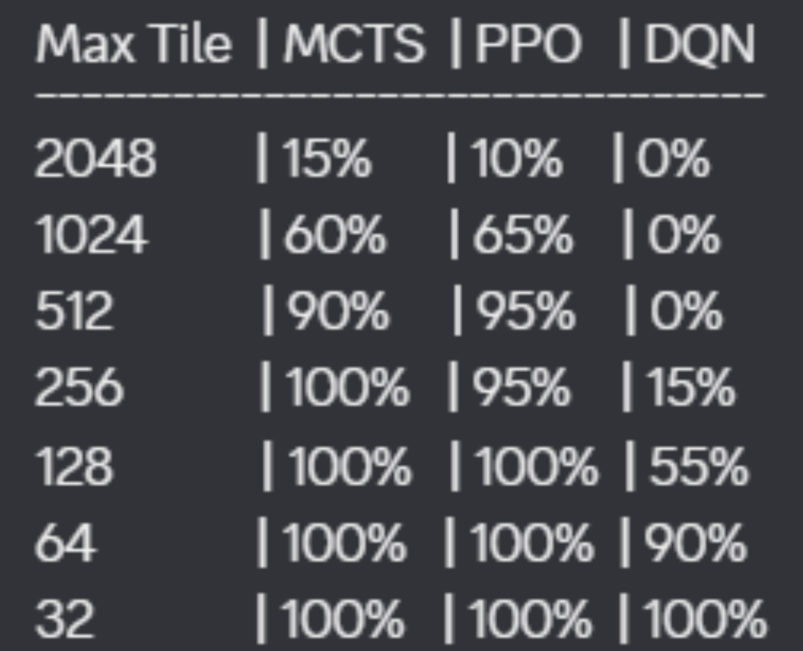
        

      

    

  

  <!-- Resources -->
  

    

      
09

      <h2 class="section-title">Resources Used</h2>
    

    

      

        <a href="https://github.com/Quentin18/gymnasium-2048/blob/main/README.md" class="ref-item" target="_blank">
          2048 GitHub Repository
          github.com/Quentin18/gymnasium-2048
          ↗
        </a>
        <a href="https://stable-baselines3.readthedocs.io/en/master/modules/dqn.html" class="ref-item" target="_blank">
          Stable Baselines3 DQN
          stable-baselines3.readthedocs.io
          ↗
        </a>
        <a href="https://arxiv.org/pdf/1312.5602" class="ref-item" target="_blank">
          DeepMind DQN Paper
          arxiv.org/pdf/1312.5602
          ↗
        </a>
        <a href="https://arxiv.org/html/2507.05465v1" class="ref-item" target="_blank">
          Stanford 2048 Paper
          arxiv.org/html/2507.05465v1
          ↗
        </a>
        <a href="https://medium.com/data-science/a-puzzle-for-ai-eb7a3cb8e599" class="ref-item" target="_blank">
          Medium — A Puzzle for AI
          medium.com/data-science
          ↗
        </a>
        <a href="https://royf.org/crs/CS175/W26/CS175L2.pdf" class="ref-item" target="_blank">
          CS175 Slides
          royf.org/crs/CS175/W26
          ↗
        </a>
        <a href="https://github.com/poomstas/2048_MCTS" class="ref-item" target="_blank">
          MCTS Graphic — poomstas/2048_MCTS
          github.com/poomstas/2048_MCTS
          ↗
        </a>
        <a href="https://stackoverflow.com" class="ref-item" target="_blank">
          MCTS UCB Graphic — StackOverflow
          stackoverflow.com
          ↗
        </a>
      

    

  

  <!-- AI Disclaimer -->
  

    

      
10

      <h2 class="section-title">AI Disclaimer</h2>
    

    

      
AI tooling was used in the following capacities:

      

        
Integrate libraries and dependencies

        
Create frontend design for GitHub Pages

        
Create GUI for 2048 games

        
Supplement personal learning of RL models

      

    

  

  <a href="status.html">← Status Report</a>
  PowerOf2 · CS 175
  <a href="index.html">Home →</a>

